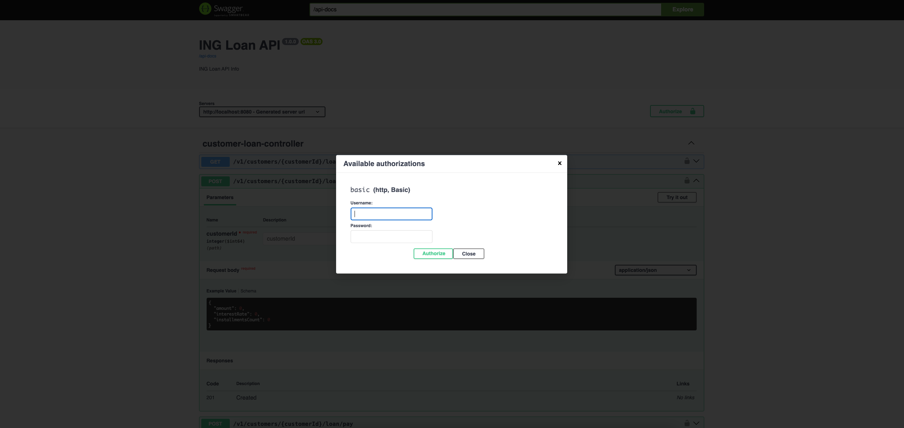

<!-- PROJECT LOGO -->
<br />
<div align="center">
<h2 align="center">ING Loan Service</h2>
</div>


<!-- ABOUT THE PROJECT -->

## About The Project

ING loan service create and manage customer loans amd loan payments

Here's why:

* Manage customer loans into payment operations
* Simplifies management operations with rest service

<!-- ARCHITECTURE THE PROJECT -->

## Architecture The Project

This project builds with [hexagonal architecture](https://en.wikipedia.org/wiki/Hexagonal_architecture_(software)) and [Domain Driven Design](https://en.wikipedia.org/wiki/Domain-driven_design)
principles. The domain layer is pure and does
not include framework-related things so this purity is give
strong open closed related areas and more testable and secure code.

with a hexagonal approach, infra-related code is removed from the business and any ports like integration point are easy
to integrate


<!-- GETTING STARTED -->

## Getting Started

This is an example of how you may give instructions on setting up your project locally.
To get a local copy up and running follow these simple example steps.

### Prerequisites

This is an example of how to list things you need to use the software.

* maven, java

### Installation

_Below is an example of how you can instruct your audience on installing and setting up your app. This template doesn't
rely on any external dependencies or services._

1. Clone the repo
   ```sh
   git clone https://github.com/Rohatsahin/rsahin-ing-case.git
   ```
2. Install packages
   ```sh
   mvn clean verify
   ```

This will also generate a jar file with all the dependencies which we will run once
it has been created.

- Run the `main` method in `IngApplication.java` by running

```sh
mvn exec:java
```

- Alternatively, you can run the `main` method in `IngApplication.java` in your chosen IDE, e.g. `IntelliJ`


<!-- USAGE EXAMPLES -->

## Usage

All installation is completed open your browser and access
swagger [Swagger](http://localhost:8080/swagger-ui/index.html)

The application comes with build in customer and admin operator. The credentials as a below for testing purpose

```
 -- CUSTOMER_1 --; username: customer_1 password: password
 -- CUSTOMER_2 --; username: customer_2 password: password
 
 -- ADMIN --; username: admin password: password

```


